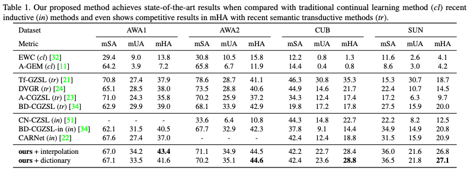

# Continual Zero-Shot Learning through Semantically Guided Generative Random Walks
This is the official PyTorch implementation for our ICCV-2023 paper

[Continual Zero-Shot Learning through Semantically Guided Generative Random Walks ](https://arxiv.org/abs/2308.XXXXX)\
Wenxuan Zhang*, [Paul Janson*](https://pauljanson002.github.io/), [Kai Yi](https://kaiyi.me/), [Ivan Skorokhodov](https://universome.github.io/), and [Mohamed Elhoseiny](https://www.mohamed-elhoseiny.com/) \
<a href='https://arxiv.org/abs/2308.XXXXX'></a> 

## Introduction
In this project, we explore the problem of inductive continual zero-shot learning.  Here, our approach stands out by not relying on any previously unseen information during training,but hallucinated (synthesized) feature instead. Through comprehensive theoretical analysis, we discover that the key lies in the density and diversity of these hallucinated examples within the feature space. 

To achieve this objective, we introduce two attribute generation techniques: interpolation and learnable dictionary. These methods work in tandem to foster a densely populated representation of the hallucinated features. Furthermore, we present an innovative Generative Random Walk (GRW) loss, guided by semantic information. This loss function is designed to enhance the diversity of the synthesized features. These allowed us to outperform both the existing transductive and inductive continual zero-shot learning methods.

We mainly follow the CZSL setting of [this paper](https://github.com/universome/class-norm). Our backbone highly depends on [this paper](https://github.com/sumitramalagi/Unseen-classes-at-a-later-time). 

## Download the dataset
Run the following script to download the dataset
```angular2html
wget http://datasets.d2.mpi-inf.mpg.de/xian/xlsa17.zip --no-check-certificate -O xlsa17.zip
unzip xlsa17
mkdir data
mv xlsa17/data/* data/
rm -rf xlsa17.zip xlsa17
```

## Environment preparation
Create and activate conda environment
```angular2html
conda env create --file environment.yaml --prefix ./env
conda activate ./env
```


## Running experiments 

```angular2html
DATASET=[AWA1|AWA2|CUB|SUN]
METHOD=[learnable|interpolation]
python main.py \
  --dataset $DATASET \
  --attribute_generation_method $METHOD \
  --batch_size 128 \
  --buffer_size 5000  \
  --load_best_hp
```


## Results


## Citation
```
@inproceedings{cgzsl,
  author    = {Wenxuan Zhang and Paul Janson and Kai Yi and Ivan Skorokhodov and Mohamed Elhoseiny},
  title     = {Continual Zero-Shot Learning through Semantically Guided Generative Random Walks},
  booktitle   = {IEEE/CVF International Conference on Computer Vision},
  year      = {2023},
}
```
